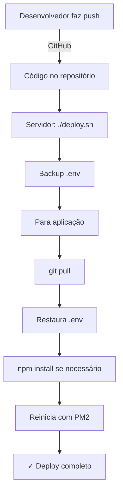

# 🚀 Guia de Deploy - FacilitaAdv

## 📋 Primeira Configuração (Apenas 1x)

### 1. **Transferir arquivos para o servidor**

```bash
# No seu computador local
scp deploy.sh setup-git-credentials.sh usuario@seu-servidor:/caminho/facilita.adv.br/
```

### 2. **Conectar ao servidor**

```bash
ssh usuario@seu-servidor
cd /caminho/facilita.adv.br/
```

### 3. **Dar permissão de execução**

```bash
chmod +x setup-git-credentials.sh
chmod +x deploy.sh
```

### 4. **Configurar Git (apenas primeira vez)**

```bash
./setup-git-credentials.sh
```

**O que faz:**
- Configura usuário Git: `artbras`
- Configura URL com token de autenticação
- Testa conexão com GitHub
- **Auto-deleta** após execução (segurança)

---

## 🔄 Deploy de Atualizações (Sempre que atualizar)

### **Comando Único**

```bash
./deploy.sh
```

### **O que faz automaticamente:**

1. ✅ Backup do `.env`
2. ✅ Para aplicação
3. ✅ Salva mudanças locais (git stash)
4. ✅ Baixa código novo (git pull)
5. ✅ Restaura `.env`
6. ✅ Instala dependências (se necessário)
7. ✅ Reinicia aplicação

---

## 📦 Estrutura de Arquivos

```
facilita.adv.br/
├── deploy.sh                    # Script de deploy
├── setup-git-credentials.sh     # Setup inicial (auto-deleta)
├── .env                          # NÃO é sobrescrito
├── .env.backup                   # Backup automático
└── app.log                       # Logs da aplicação
```

---

## ⚙️ Gerenciamento com PM2 (Recomendado)

### **Instalar PM2**

```bash
npm install -g pm2
```

### **Configurar auto-start**

```bash
pm2 startup
pm2 save
```

### **Comandos Úteis**

```bash
# Ver status
pm2 status

# Ver logs
pm2 logs facilita-adv

# Reiniciar manualmente
pm2 restart facilita-adv

# Parar
pm2 stop facilita-adv

# Deletar
pm2 delete facilita-adv
```

---

## 🔐 Segurança

### **Token GitHub**

- ✅ Token está no `setup-git-credentials.sh` (executa 1x e auto-deleta)
- ✅ Após setup, token fica no cache do Git (1 hora)
- ⚠️ **NUNCA** commite `setup-git-credentials.sh` no GitHub

### **Arquivo .env**

- ✅ Sempre faz backup antes do pull
- ✅ Sempre restaura após pull
- ❌ Nunca vai para o GitHub (`.gitignore`)

---

## 🐛 Troubleshooting

### **Erro: "Permission denied"**

```bash
chmod +x deploy.sh
```

### **Erro: "Git authentication failed"**

```bash
# Reexecutar setup
./setup-git-credentials.sh
```

### **Erro: "Port already in use"**

```bash
# Verificar processos
ps aux | grep node

# Matar processo
pkill -f "tsx server/index.ts"

# Ou com PM2
pm2 delete all
```

### **Aplicação não inicia**

```bash
# Ver logs
tail -f app.log

# Ou com PM2
pm2 logs facilita-adv --lines 100
```

### **Reverter deploy**

```bash
# Ver stash salvo
git stash list

# Aplicar último stash
git stash pop

# Ou commit específico
git reset --hard HEAD@{1}
```

---

## 📊 Fluxo Completo de Deploy



---

## ✅ Checklist Pós-Deploy

- [ ] Acessar `https://seu-dominio.com` e verificar se carrega
- [ ] Testar login
- [ ] Testar criação de documento no FaciliSign
- [ ] Verificar logs: `pm2 logs facilita-adv`
- [ ] Monitorar por 10min para garantir estabilidade

---

## 🔄 Rollback Rápido

Se algo der errado:

```bash
# Opção 1: Voltar 1 commit
git reset --hard HEAD~1

# Opção 2: Aplicar stash salvo
git stash list
git stash apply stash@{0}

# Opção 3: Commit específico
git log --oneline
git reset --hard <commit-hash>

# Reiniciar
pm2 restart facilita-adv
```

---

## 📞 Suporte

**Logs em tempo real:**
```bash
pm2 logs facilita-adv --lines 200
```

**Status da aplicação:**
```bash
pm2 status
curl http://localhost:5000/health  # Se tiver endpoint de health
```

**Monitoramento:**
```bash
pm2 monit
```
